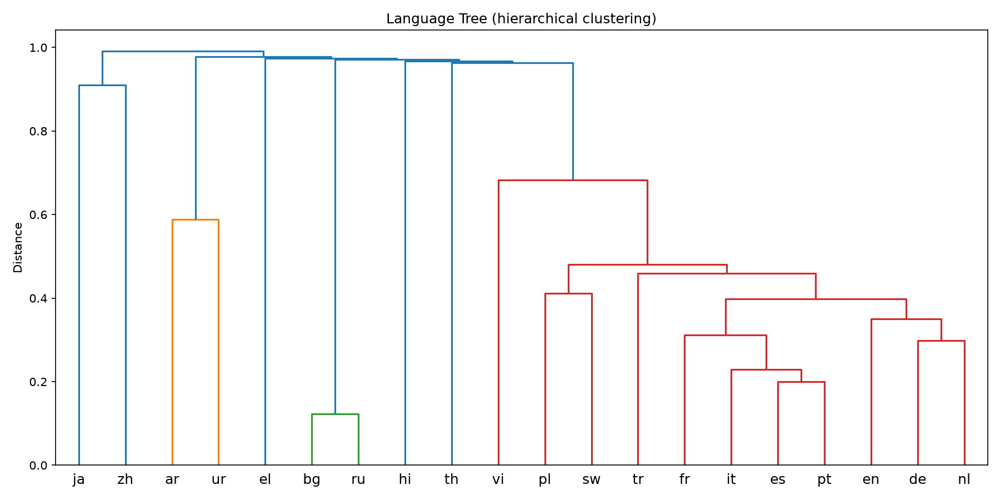
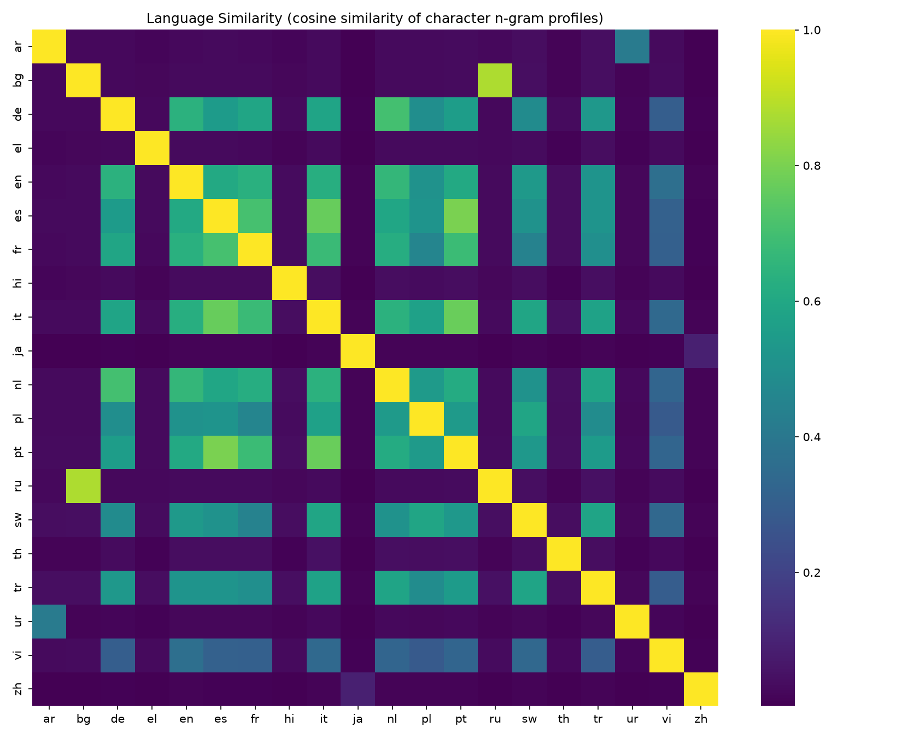
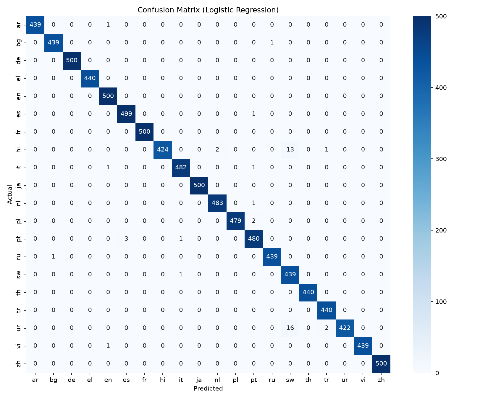

# LinguaScope

Machine learning system for multilingual language identification and comparative linguistic analysis.

## What it does
- Detects the language of any text (20 languages, including Hindi, Urdu, Arabic and Japanese)
- Compares languages using character n-gram profiles
- Builds a language similarity heatmap and a language tree (dendrogram)
- Has a Streamlit web interface

## Method
Text cleaning, then TF-IDF character n-grams (1 to 3), then Logistic Regression and Naive Bayes.
Short-text data augmentation was added because the dataset has mostly long reviews.

## Results
- Logistic Regression accuracy: XX.XX%
- Naive Bayes accuracy: XX.XX%
- Short-text accuracy (1 to 6 words): XX.XX%

## Screenshots

## How to run
pip install -r requirements.txt
python get_data.py
python linguascope.py
streamlit run app.py

## Dataset
papluca/language-identification on Hugging Face.

## Future work
Indian languages (Bhojpuri, Maithili, Magahi), Hinglish detection, fastText or BERT comparison.